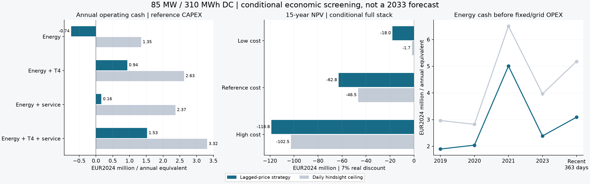

# 储能收益叠加与经济可行性复核

截至 2026-09-10；对象：Croaghonagh 候选 **85 MW / 310 MWh（DC 铭牌）**。金额统一为 **2024 年实际欧元**，下表金额单位均为 **百万欧元**。采用税前、无杠杆口径，15 年寿命与 7% 实际折现率。

**结论：收入叠加能改善运营现金流，但当前公开基准仍不足以支持原尺寸项目达到 7% 回报门槛。** 近期价格下，纯交易年运营现金流约为 **-0.74**；加入条件容量收入与假设系统服务后约为 **1.53**。参考总投资 **75.92**，即使按相同收入条件延续 15 年，NPV 仍为 **-62.84**。这些是可复算的条件筛选结果，不能称为 2033 年预测利润或已锁定收入。

## 1. 收益从哪里来

| 收入安排（均无已签合同） | 预测策略年运营现金流 | 事后最优年运营现金流 |
| --- | --- | --- |
| 纯电价交易 | -0.74 | 1.35 |
| 交易＋T-1 容量价格参考 | -0.25 | 1.44 |
| 交易＋T-4 容量价格参考 | 0.94 | 2.63 |
| 交易＋假设系统服务 | 0.16 | 2.37 |
| 交易＋T-4 容量参考＋假设系统服务 | 1.53 | 3.32 |

表中的系统服务价格是 **€4/可行预留 MW·h** 的测试输入，已扣 10% 支付折减并计入假设激活的能量损耗；它不是未来 FASS 报价。容量金额使用已公布 T-1 / T-4 价格参考、同一条公开时长折减曲线及明确假设的中标份额。近期窗口为 **2025-09-12 至 2026-09-09，363 天、8,712 小时**；年化系数为 **8760/8712 = 1.00551**，没有补造缺失价格。另回测完整的 2019、2020、2021、2023 年。数据来自 [SEMOpx](https://www.semopx.com/market-data)。

“预测策略”只使用至少隔开前一交割日的历史价格，按旧价格预测各时段；“事后最优”预知当日所有价格，只作为同一调度约束下的现金上限。每天 SOC 连续地回到同一库存，限制最多一次等效循环；跨日投机价值未计入。大规模储能对市场价格的影响、未确定的限发及实际订单成交尚未验证，因此即使预测策略结果也不是实盘业绩。

没有额外叠加独立最优的日内/平衡利润、弃风价值、网损价值、碳信用或未签订的局部灵活性合同。系统成本节省保留为社会价值。整站租赁作为替代商业结构单独计算。

## 2. 一笔现金流逐项核对

以下为近期预测策略、参考成本、T-4 价格参考与 €4 系统服务情景的首年年化账本：

| 项目 | 百万欧元/年 |
| --- | --- |
| 放电售电收入 | 9.71 |
| 减：充电购电成本 | -7.22 |
| 加：假设系统服务毛收入 | 1.38 |
| 加：条件容量毛收入 | 1.98 |
| 减：服务扣减及容量差价回缴 | -0.14 |
| 减：交易费及进口附加费 | -0.35 |
| 减：含维持容量增补的固定运维 | -2.84 |
| 减：G-TUoS 区域代理及辅助负荷费用 | -0.99 |
| 税前、无杠杆运营现金流 | 1.53 |

售电额不是利润；充电购电只扣一次。系统服务和容量义务与交易共享逆变器功率、SOC 及持续时间。容量差价回缴采用明确的 **€500/MWh 测试执行价及日前价格代理**，不能冒充真实容量市场结算；同时以每时段保留容量义务所需四小时能量的方式进行保守压力测试。[容量市场机制](https://www.sem-o.com/markets/capacity-market-overview)。

## 3. 成本与投资门槛

| 建设成本情景 | 总投资 | 叠加后年运营现金流 | 15 年 NPV | 每年额外净现金流缺口 |
| --- | --- | --- | --- | --- |
| 低成本 | 43.04 | 2.80 | -18.00 | 1.98 |
| 参考成本 | 75.92 | 1.53 | -62.84 | 6.90 |
| 高成本 | 117.63 | 0.01 | -118.79 | 13.04 |

以上均采用同一预测策略与叠加收入条件。额外现金流缺口是**扣除新增成本和机会成本后、持续 15 年的净额**，不是自动可以再出售的服务。合同只持续一年时，参考成本下 NPV 为 **-81.38**；到期后模型恢复纯交易并停止容量、服务收入。15 年持续情景只是续约/价格不变的敏感性假设。

成本以 [NREL 2025 报告](https://docs.nlr.gov/docs/fy25osti/93281.pdf) 的 2033 年预测为起点，按公开功率/能量成本分量推算时长，再加入**假设**的爱尔兰安装系数和 €2m/€5m/€10m 接网预算。并非本项目 EPC 或接网报价。汇率为 [Fed 2024 年平均](https://www.federalreserve.gov/releases/g5a/20250106/)，历史电价逐月按 [CSO CPI](https://data.cso.ie/table/CPM20) 转为实际欧元；尚未公布的 2026 年 9 月 CPI 和未来网费使用 8 月指数作为明确代理。

[NREL ATB](https://atb.nlr.gov/electricity/2025/utility-scale_battery_storage) 的 **4% 年固定运维包含维持额定容量的增补**，所以没有再收取电芯替换/增补现金支出或额外磨损现金费用。预测策略优化仍采用 €2/MWh 的非现金磨损偏好项，事后最优策略设为零。维护是否真能以该成本实现，需要供应商保证。固定运维、网费、辅助负荷费用在参考情景合计约 **3.83 /年**。网费采用附近 Meentycat 的区域代理，依据 [EirGrid 2026/27 收费表](https://cms.eirgrid.ie/sites/default/files/publications/Statement_of_Charges_2026-2027.pdf)，不是 Croaghonagh 的确认费率。

## 4. 租赁/保底合同应该谈到什么水平

如果将全部市场交易权交给交易商，业主仅收固定整站租赁费，并承担本模型的固定运维、G-TUoS、辅助负荷及退役费用，要实现 7% 回报，需要的固定费门槛为：

| 成本情景 | 整站年度固定租赁费门槛 | 折合 €/MW·年 |
| --- | --- | --- |
| 低成本 | 7.34 | 86,294 |
| 参考成本 | 12.26 | 144,217 |
| 高成本 | 18.40 | 216,481 |

这是一种**替代方案**，不能再把全部交易、容量和系统服务收益加给业主。表中没有融资税盾、债务或合同罚款，也不是市场实际可获得的租赁报价。参考情景若获得的报价明显低于门槛，应调整造价、容量或商业安排，而不是叠加无付款方的社会效益。

## 5. 技术可行性仍有哪些边界

- 310 MWh 按 10%–90% SOC、85% 往返效率折算，交流可交付能量为 **228.645 MWh**，约 **2.690 小时**。不能按四小时储能取满容量收入；采用公开参考折减后再考虑 97% 能力，条件容量约 **15.576 MW**。
- 修正区域抽取保留 Firlough、Srananagh 两个电压层级及变压器。全 168 小时重放的最大内部潮流误差为 **6.75e-11 MW**；这证明与给定全岛模型电气一致，不等于现实 AC/N−1 校核。
- 原 15 节点模型上，85/310 通过旧“恢复弃风比例”指标，但同一电池在放松目标线路后仍有 **546.30 MWh** 弃风改善空间。旧指标不能证明已消除约束。
- 全岛 N−0 下，Croaghonagh 的 ±85 MW 固定注入压力测试均无失负荷或热越限，但持续放电测试使周内可再生弃电增加 **10,189.54 MWh**。这是通过再调度容纳功率，不能解释为免费接入余量；该恒功率压力测试也不是储能能量上可持续的周调度。
- 历史真实价格未与 2033 合成电网周伪装为同期观测。N−1、正式 MIC/MEC/接网权、全年受约束商用调度、市场资格及合同仍需补齐，才能进一步收敛为可融资预测。

## 6. 下一步的决策顺序

先用这里的成本和合同门槛筛选 EPC、接网及交易商报价，同时比较 170/310/510 MWh 的容量方案；再将可获得的真实收入合同和报价替换敏感性参数。随后对候选地点做 N−1 与含限发的全年商用调度。只有这些条件通过，才把收益称为可融资测算。

在低建设成本、相同预测策略和持续 15 年条件叠加收入下：

| DC 容量 | 年运营现金流 | 15 年 NPV | 每年额外净现金流缺口 |
| --- | --- | --- | --- |
| 170 MWh | 0.95 | -22.91 | 2.52 |
| 310 MWh | 2.80 | -18.00 | 1.98 |
| 510 MWh | 4.49 | -19.61 | 2.15 |

已测的 170/310/510 MWh 中，310 MWh 的预测策略 NPV 最好，但仍为负；不建设的 NPV=0 优于所有已测预测策略情景。36 个组合中唯一正 NPV 出现在 510 MWh、低造价、事后最优且持续叠加收入的情景（约 +€2.33m），不能据此宣称可实现盈利。这是有限方案筛选，不是全局最优容量证明。

现行 DS3 费率不外推到 2033：相关产品转入竞争采购或达到 2027-09-30 长停日期后旧安排终止，未来服务价值需按新规则/合同另定。[SEM-25-031](https://www.semcommittee.com/files/semcommittee/2025-06/SEM-25-031%20System%20Services%20Regulated%20Arrangements%20to%20FASS%20-%20The%20Gap%20-%20Decision%20Paper.pdf)。因此当前**已锁定容量及服务收入为零**，上表均清楚标为条件情景。

完整来源、参数、逐年账本、调度及哈希随项目保存。结果可复算，研究假设可以替换，负 NPV 也被保留。
