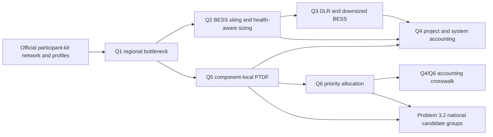

# Final Technical, Economic, and Data-Lineage Audit

Generated: **2026-09-10T06:52:41.590796+00:00**  
Repository branch: **problem/3.1-north-west-analysis**  
Git commit: **8c506d655ba9e4df6b2bd9ac1869d625c89a359b**  
Report version: **1.1.0**

This report is the auditable handoff for Problem 3.1 Questions 1–6 and the implemented Problem 3.2 national extension. It distinguishes official project input, model-derived results, scenario choices, commercial assumptions, demonstrations, and unimplemented items. It is scenario analysis, not investment advice, a grid-connection offer, or an operational instruction.

## 1. Executive decision summary

1. **Q1 regional constraint [CLM-Q1-001 | MODEL_DERIVED].** In the North-West model, branch `5041-17010-2` binds for **52 hours** at a static **210 MVA** rating. A 25% uplift reduces dispatch-down by **588.613899 MWh** [EV-Q1-001–009]. The all-island robustness run reports zero binding hours and 55.9091% maximum loading, so the 52-hour result is not a national claim [EV-Q1-010–011].

2. **Q2 storage recommendation [CLM-Q2-001 | MODEL_DERIVED].** The health-aware recommendation is **Croaghonagh, 85 MW / 310 MWh**, with **198.4 MWh** usable at 80% end-of-life SoH and a 10–90% SOC window [EV-Q2-001–017]. This is distinct from the 90 MW / 440 MWh Q4 comparison candidate.

3. **Q3 combined technical result [CLM-Q3-001 | MODEL_DERIVED].** Selected DLR plus a **62.22 MW / 226.92 MWh** downsized BESS gives the strongest tested regional technical outcome: **2529.746978 MWh** dispatch-down, a **1130.843295 MWh** reduction from baseline [EV-Q3-001A–015]. Standalone benefits overlap by **235.067009 MWh**, so they must not be added independently.

4. **Q4 economic decision [CLM-Q4-001 | MODEL_DERIVED under COMMERCIAL_ASSUMPTION].** No build has the highest tested project NPV: **€0.00**. Among built cases, **22.5 MW / 110 MWh** is least negative at **-€41,129,703.09**. Larger tested batteries improve the technical metric but make project NPV more negative. System savings are kept outside project cash flow [EV-Q4-000, EV-Q4-001A–004I]. In the matched DLR crosswalk, the 45/220 conditional BESS NPV improves by **€276,041.76** but remains negative; DLR investment cost and revenue are not included [EV-Q4-L2D–L2I].

5. **Q4 distributed comparison [CLM-Q4-003 | MODEL_DERIVED].** Splitting the same 45 MW / 220 MWh across the four tested electrically equivalent buses changes lifetime net renewable gain by only **6.286e-09 MWh**, while each additional site worsens NPV by about **€941,970.74**. The deterministic tie rule therefore selects one site. This conclusion is limited to these candidates and this PTDF/topology [EV-Q4-D1A–D4B].

6. **Q5 electrical impact [CLM-Q5-001 | MODEL_DERIVED].** Croaghonagh's target-line PTDF is **-0.238395702387 MW/MW**. Under the observed opposite-direction congestion, 45 MW charging provides **10.727806607 MW** of first-order relief. The maximum independent LPF reconstruction error is **4.885e-15** [EV-Q5-001–009].

7. **Q6 priority allocation [CLM-Q6-001 | MODEL_DERIVED under SCENARIO_CHOICE].** Priority dispatch changes total wind dispatch-down by only **9.095e-13 MWh**, while transferring **2603.625666 MWh** away from priority farms onto non-priority farms. This is allocation, not extra energy, BESS revenue, or system saving [EV-Q6-001–009].

8. **Problem 3.2 national extension [CLM-Q32-001 | MODEL_DERIVED].** The final all-island 168-hour run contains **754 buses, 980 passive branches, 16 directional modes, 2168 memberships, 16 complete-link groups, and 5 mutually exclusive response zones**. Maximum LPF error is **6.036e-13** [EV-Q32-001–019]. These are algorithm-generated planning signals, not official operational Constraint Groups.

## 2. Evidence taxonomy and accounting boundaries

| Label | Meaning | Required presentation treatment |
| --- | --- | --- |
| OFFICIAL_INPUT | Network/resource data supplied in the participant kit | Call it official project input, not necessarily observed real-world data |
| MODEL_DERIVED | Solver or post-processing result | Cite the exact result cell, scope, horizon, code, and validation |
| COMMERCIAL_ASSUMPTION | Price, CAPEX, OPEX, discount rate, life, or similar input | Mark it illustrative unless sourced to a market quote |
| SCENARIO_CHOICE | Candidate, threshold, balancing reference, or priority label | Do not present it as observed policy or fact |
| DEMONSTRATION | Smoke or deliberately simplified run | Never use as a headline result |
| NOT_IMPLEMENTED | Discussed capability absent from the model | Do not claim associated revenue or benefit |

Three accounting lenses are deliberately separate:

- **Technical:** dispatch-down, congestion, directional relief, and feasible operation.
- **Developer/project:** project revenue, energy purchase, CAPEX, O&M, maintenance, NPV, and payback.
- **System:** dispatch-cost saving and other physical system effects. A system saving is not developer revenue without an explicit contract or tariff.

## 3. Repository and run provenance

- Root: `/workspaces/tpsa-grid-hackathon-2026`
- Branch: `problem/3.1-north-west-analysis`
- Commit: `8c506d655ba9e4df6b2bd9ac1869d625c89a359b`
- Dirty worktree: **yes**, because the requested implementation and pre-existing Q2/Q3 work remain uncommitted.
- `AGENTS.md` at repository root: **False**.
- `CODEX_Q4_HANDOFF.md` at repository root: **False**.
- No commit, merge, or push command was executed by this work session. Local Git metadata cannot cryptographically prove the absence of a push; `RUN_MANIFEST.json` records the precise statement.
- Official participant-kit paths have Git status: **no tracked or untracked changes reported**.

The machine-readable provenance is in `RUN_MANIFEST.json`; source and result hashes are in `SOURCE_CHECKSUMS.csv`.

### Protected pre-existing Q1–Q3 files

| Path | Baseline SHA-256 | Final SHA-256 | Status |
| --- | --- | --- | --- |
| results/problem_3_1/question_2/tables/04_single_site_screening.csv | 329a856ff33f24d75f3d44c347e0c7863c4a9caf34f87c055a822460ca0c87d6 | 329a856ff33f24d75f3d44c347e0c7863c4a9caf34f87c055a822460ca0c87d6 | PASS |
| results/problem_3_1/question_2/tables/05_two_site_screening.csv | db5db4d91c4330f0340e4b4d1102e21b5890b2f6d139532c77439c4b6b3fe296 | db5db4d91c4330f0340e4b4d1102e21b5890b2f6d139532c77439c4b6b3fe296 | PASS |
| results/problem_3_1/question_2/tables/06_theoretical_sizing_trials.csv | 257bb8e1a2aaa1cfed6aef413b8a57385dbb574a17ec4e92f6820280a58fd85b | 257bb8e1a2aaa1cfed6aef413b8a57385dbb574a17ec4e92f6820280a58fd85b | PASS |
| results/problem_3_1/question_2/tables/07_health_aware_sizing_trials.csv | a1b5f119e7c51f4b0c473834a35791fb99be23c4aea57e2fab9d58f46752c680 | a1b5f119e7c51f4b0c473834a35791fb99be23c4aea57e2fab9d58f46752c680 | PASS |
| results/problem_3_1/question_2/tables/09_health_aware_pareto_frontier.csv | 391db6b9655ca311e1df784dfd0ed9ac624db4e4fe0edc0e05d7baa1d0a2057c | 391db6b9655ca311e1df784dfd0ed9ac624db4e4fe0edc0e05d7baa1d0a2057c | PASS |
| results/problem_3_1/question_2/tables/10_recommendation_summary.csv | 91420697371250f1e4eeb66a0e89ac17ebd81eace89b9d19b00b3b213a61744c | 91420697371250f1e4eeb66a0e89ac17ebd81eace89b9d19b00b3b213a61744c | PASS |
| results/problem_3_1/question_2/tables/_trial_cache.csv | 6cd4409dad96456c0076ef1e31cdb99da79c4687a72cd7efb089077f23b4125a | 6cd4409dad96456c0076ef1e31cdb99da79c4687a72cd7efb089077f23b4125a | PASS |
| src/problem_3_1/constrained_lines.py | 64ec0564ea241c11fc1c4b47fc4fa8c6820f827c43f5c5d6b24f4b9766e710ce | 64ec0564ea241c11fc1c4b47fc4fa8c6820f827c43f5c5d6b24f4b9766e710ce | PASS |
| src/problem_3_1/question_2_battery_siting_sizing.py | 04ae1273725f1a3ac202c3d924599c762bfdb385da0cbc798b74c073e65ec04d | 04ae1273725f1a3ac202c3d924599c762bfdb385da0cbc798b74c073e65ec04d | PASS |
| src/problem_3_1/question_3_dynamic_line_rating.py | 979c964f6e2564c82fd5c803c5b33f354192959a2811744bf552f670e5f10916 | 979c964f6e2564c82fd5c803c5b33f354192959a2811744bf552f670e5f10916 | PASS |

All protected files match the task-start hashes. This preserves the user's pre-existing uncommitted Q2/Q3 work byte-for-byte.

## 4. End-to-end lineage

Q5 describes topology sensitivity; Q6 describes policy allocation. Q6 status labels are not used to construct PTDF. Q3 rating-only DLR changes capacity/headroom, not reactance or PTDF.

## 5. Q1 — constrained line

**Direct answer [CLM-Q1-001].** `5041-17010-2` is the binding regional line, stored in the positive orientation **Srananagh 220 → Cathaleen's Fall**. The model checks absolute loading, so both directions count.

- Exact result source: `results/problem_3_1/question_1_final/tables/02_line_constraint_and_rating_results.csv`, row `line == "5041-17010-2"`.
- Static rating: 210 MVA [EV-Q1-001].
- Binding: 52 h; at/above 90%: 63 h [EV-Q1-002–003].
- Mean, p95, and maximum loading: 61.8469%, 100.0000%, 100.0000% [EV-Q1-004–005].
- At 262.5 MVA: dispatch-down is 3071.976374 MWh and binding falls to 17 h [EV-Q1-006–009].

**Worked example [CALC-Q1-001/002].** Baseline dispatch-down is reconstructed as 3071.976374 + 588.613899 = 3660.590273 MWh. The uplift saves 588.613899 MWh; dividing by 52.5 added MVA gives 11.211693 MWh per added MVA.

**Scope warning.** `results/problem_3_1/question_1_final/tables/05_all_island_scope_robustness.csv` reports 0 all-island binding hours and 55.9091% maximum loading [EV-Q1-010–011]. This is a boundary/topology scope difference, not evidence that one result should overwrite the other.

Code locator: `src/problem_3_1/constrained_lines.py::line_reinforcement_trials lines 198-245`.

## 6. Q2 — BESS siting and health-aware sizing

**Direct answer [CLM-Q2-001].** The recommended installed capacity is **Croaghonagh, 85 MW / 310 MWh**, based on the lifetime-aware end-of-life verification row in `results/problem_3_1/question_2_final/tables/10_recommendation_summary.csv`.

- SOC window: 10–90%; round-trip efficiency: 90%; EOL SoH: 80% [EV-Q2-005–008].
- Dispatch-down: 2870.199738 MWh; net improvement: 790.390535 MWh [EV-Q2-009–010].
- Affected-generator gain: 850.703846 MWh; this is 60.313311 MWh above the total net improvement and therefore includes redistribution [EV-Q2-011; CALC-Q2-003].
- Target benchmark recovery: 105.1648%; this means the defined benchmark is exceeded, not that more than all grid curtailment is recovered [EV-Q2-012].
- Throughput: 2683.3128 MWh/week; 6.762381 usable EFC/week; simultaneous charge/discharge: 0 h [EV-Q2-013–015].
- Target binding hours rise to 61; binding-hour count is not the sole objective because additional renewable operation can use the available line headroom more often [EV-Q2-016].
- Architecture conclusion: two-site layout did not materially improve the same-capacity probe result [EV-Q2-017].

**Worked example [CALC-Q2-001].** 310 × 0.80 × (0.90 − 0.10) = **198.4 MWh** usable at end of life.

Code locator: `src/problem_3_1/question_2_battery_siting_sizing.py::verify_lifetime_recommendation lines 902-914`.

## 7. Q3 — DLR and combined intervention

| Scenario | Dispatch-down (MWh) | Saving vs baseline (MWh) | Target binding hours |
| --- | --- | --- | --- |
| Baseline | 3,660.590273 | 0.000000 | 52 |
| Selected DLR | 3,085.070505 | 575.519768 | 29 |
| 85/310 BESS | 2,870.199738 | 790.390535 | 61 |
| DLR + 62.22/226.92 BESS | 2,529.746978 | 1,130.843295 | 33 |

The selected DLR mean and maximum multipliers are 1.095551 and 1.279501 [EV-Q3-010–011]. At a 210 MVA static rating, the presentation conversion is 210 × 1.095551 = 230.066 MVA mean and 210 × 1.279501 = 268.695 MVA maximum.

**Worked example [CALC-Q3-001].** 3660.590273 − 2529.746978 = **1130.843295 MWh** saved. The BESS is 85 × 0.732 = 62.22 MW and 310 × 0.732 = 226.92 MWh. Its EOL usable energy is 226.92 × 0.80 × 0.80 = 145.2288 MWh.

**Interaction warning [CALC-Q3-002].** Standalone DLR plus standalone BESS savings exceed the joint result by 235.067009 MWh, calculated from unrounded source cells. Subtracting the independently rounded six-decimal values displayed above gives 235.067008 MWh. This is overlapping benefit/marginal diminishing return, so standalone improvements must not be added.

Code locator: `src/problem_3_1/question_3_dynamic_line_rating.py::search_dlr_battery_scales lines 738-754`.

## 8. Q4 — from technical best to economic best

The following values come from the corrected final 168-hour rerun in `results/problem_3_1/question_4_economic_downsizing_168h_20260910_v2/04_technical_revenue_cost_npv_payback.csv`. Monetary totals are 20-year real-2026-EUR scenario totals unless explicitly described as present value. The repeated-week annualisation and flat price are commercial/model assumptions, not observations.

Configured commercial assumptions are a 20-year project, 7.0% real discount rate, flat €70.00/MWh energy price, repetition of the 168-hour block to 8760 hours/year, €0.00/kW-year grid-service payment, and `real EUR, 2026 purchasing power; pre-tax unlevered` [EV-Q4-A01–A08]. They are illustrative inputs, not market quotes.

| Case | 20-year lifetime net RE gain (MWh) | Project revenue | Energy purchase | O&M | Maintenance CAPEX | Initial CAPEX | System saving | Project NPV | Discounted payback |
| --- | --- | --- | --- | --- | --- | --- | --- | --- | --- |
| No build | 0 | 0 | 0 | 0 | 0 | 0 | 0 | 0 | Not applicable |
| 22.5 MW / 110 MWh | 281,012.839 | €40,761,593.34 | €45,290,659.27 | €5,401,029.24 | €19,190,000.00 | €27,197,500.00 | €47,876,313.01 | -€41,129,703.09 | Not reached |
| 45 MW / 220 MWh | 553,004.222 | €73,927,244.92 | €82,141,383.25 | €10,117,551.75 | €38,380,000.00 | €53,790,000.00 | €86,144,340.62 | -€79,856,991.62 | Not reached |
| 67.5 MW / 330 MWh | 795,545.682 | €104,902,609.85 | €116,558,455.39 | €14,818,429.36 | €57,570,000.00 | €80,382,500.00 | €119,739,807.06 | -€118,941,650.81 | Not reached |
| 90 MW / 440 MWh | 1,027,014.474 | €134,099,753.85 | €148,999,726.50 | €19,506,605.38 | €76,760,000.00 | €106,975,000.00 | €150,114,122.10 | -€157,909,623.84 | Not reached |

**Decision.** No build is the economic winner in this evaluated set. The 22.5/110 case is only the **least-negative built case**, not a profitable or globally optimal battery. The 90/440 case is the technical maximum among the four requested Q4 candidates, but it is not the Q2 result; Q2 recommends 85/310.

**Worked cash-account example [CALC-Q4-001].** For 45/220, using unrounded source values, project revenue minus energy purchase and O&M is €73,927,244.921422 − €82,141,383.246025 − €10,117,551.749439 = **-€18,331,690.074041**, reported independently to cents as -€18,331,690.07. This is not an NPV reconstruction; annual timing, discounting, maintenance, decommissioning, and residual values remain in the annual cash-flow files.

**Accounting guard.** `system_saving_included_in_project_cashflow` is false in every case [EV-Q4-001I–004I]. System dispatch-cost saving is not added to developer revenue or project NPV.

### Same-basis DLR crosswalk

The matched comparison below comes from `results/problem_3_1/question_4_final_comparison_20260910_v3/01_capacity_fixed_vs_dlr.csv`. “Fixed BESS gain” and “incremental BESS gain with DLR” each use their own scenario-matched no-build counterfactual; “total DLR+BESS gain” uses the fixed-line no-build counterfactual. This keeps physical baselines explicit.

The Q3 table is a raw 168-hour technical comparison. This Q4 crosswalk is a 20-year lifetime aggregation in which capacity degradation and maintenance states are re-solved annually, so its MWh values are not directly comparable to the Q3 weekly MWh values even for the same 62.22 MW / 226.92 MWh design.

| Battery | 20-year fixed BESS gain (MWh) | 20-year incremental BESS gain with DLR (MWh) | 20-year total DLR+BESS gain vs fixed (MWh) | Fixed project NPV | Conditional BESS NPV under DLR network state | Conditional NPV change |
| --- | --- | --- | --- | --- | --- | --- |
| 22.5 MW / 110 MWh | 281,012.839 | 274,779.976 | 874,964.877 | -€41,129,703.09 | -€40,452,297.33 | €677,405.76 |
| 45 MW / 220 MWh | 553,004.222 | 515,983.929 | 1,116,168.830 | -€79,856,991.62 | -€79,580,949.85 | €276,041.76 |
| 62.22 MW / 226.92 MWh | 579,760.969 | 537,785.819 | 1,137,970.719 | -€92,444,917.01 | -€90,907,513.86 | €1,537,403.15 |
| 67.5 MW / 330 MWh | 795,545.682 | 745,740.774 | 1,345,925.675 | -€118,941,650.81 | -€117,046,342.01 | €1,895,308.79 |
| 85 MW / 310 MWh | 759,382.748 | 707,221.012 | 1,307,405.912 | -€124,119,703.66 | -€123,543,914.57 | €575,789.08 |
| 90 MW / 440 MWh | 1,027,014.474 | 975,931.595 | 1,576,116.496 | -€157,909,623.84 | -€155,218,773.06 | €2,690,850.78 |

These six rows combine two design-anchor families rather than one monotonic duration sweep: the four requested Q4 candidates are 4.8889-hour batteries, while the Q3 62.22/226.92 and Q2 85/310 anchors are approximately 3.6471-hour batteries. The energy values therefore do not increase monotonically with power.

DLR standalone lifetime gain is 600184.900945 MWh in every matched row [EV-Q4-L1I–L6I].

**Worked interaction example [CALC-Q4-003].** For 45/220, 600184.900945 + 553004.221785 − 1116168.830052 = **37020.292678 MWh** overlap. DLR therefore reduces the battery's incremental technical gain in this matched case; the two standalone benefits must not be added.

**Worked conditional-NPV example [CALC-Q4-004].** For 45/220, using unrounded source values, -€79,580,949.854553 − (-€79,856,991.616124) = **€276,041.761571**, reported independently to cents as €276,041.76. Table deltas are calculated from unrounded source values, so subtracting two independently rounded displayed NPVs can differ by €0.01. The battery remains negative-NPV.

`dlr_cost_included_in_conditional_bess_npv` is false for every row [EV-Q4-L1H–L6H]. These conditional columns contain BESS-project cash flows under the DLR network state only. They exclude DLR CAPEX, DLR OPEX, and DLR-owner revenue, so they cannot rank a DLR investment or be called an integrated project NPV.

Primary code locators: `src/problem_3_1/q4_techno_economic/pipeline.py::main lines 139-286` and `src/problem_3_1/q4_techno_economic/reporting.py::write_report lines 63-125`.

## 9. Q4 — one-, two-, three-, and four-site storage

All portfolios keep total capacity fixed at 45 MW / 220 MWh.

| Sites | Buses | 20-year lifetime net RE gain (MWh) | Initial CAPEX | Lifetime O&M | Project NPV |
| --- | --- | --- | --- | --- | --- |
| 1 | Croaghonagh | 553,004.221785 | €53,790,000.00 | €10,117,551.75 | -€79,856,991.62 |
| 2 | Croaghonagh;Binbane | 553,004.221785 | €54,395,000.00 | €10,747,801.75 | -€80,798,962.36 |
| 3 | Croaghonagh;Binbane;Ardnagappary | 553,004.221785 | €55,000,000.00 | €11,378,051.75 | -€81,740,933.10 |
| 4 | Croaghonagh;Binbane;Ardnagappary;Drumkeen | 553,004.221785 | €55,605,000.00 | €12,008,301.75 | -€82,682,903.85 |

The technical spread is 6.286e-09 MWh, below the report tie tolerance `max(1e-6, |maximum| × 1e-9)`. The tie-break then chooses fewer sites, lower initial CAPEX, and case ID. The mean incremental NPV penalty is €941,970.74 per additional site [CALC-Q4-002].

Presentation-safe wording: **within the tested electrically equivalent buses and fixed total capacity, distribution adds fixed site/connection cost without material technical gain.** It is not evidence that distributed storage is universally inferior.

## 10. Q5 — directional shift factors

The canonical result contains 14 wind farms and uses component-local balancing. The target line is positive from **Srananagh 220 to Cathaleen's Fall**, while the dominant binding direction is **Cathaleen's Fall to Srananagh 220** [EV-Q5-004–006].

- Croaghonagh PTDF: -0.238395702387 MW/MW injection [EV-Q5-002].
- Directional relief from curtailment/charging in the observed constraint direction: 0.238395702387 MW/MW [EV-Q5-003].
- 45 MW charging relief: 45 × 0.238395702387 = **10.727806607 MW** [CALC-Q5-001].
- Full-curtailment first-order relief: 139.2 × 0.238395702387 = **33.184682 MW** [CALC-Q5-002].
- Moy factor: 0.0, because Moy is in a different passive AC component [EV-Q5-007].
- Maximum independent LPF error: 4.885e-15; this validates linear-model implementation, not real AC-system accuracy [EV-Q5-008].
- Maximum PTDF change after a rating-only DLR test: 0.0; rating changes headroom, not topology/reactance [EV-Q5-009].

Code locator: `src/problem_3_1/q5_shift_factors/core.py::component_adjust_reference lines 215-261`.

## 11. Q6 — priority and non-priority dispatch

Priority status is a **SCENARIO_CHOICE**: the four Q4 sites are labelled priority because no official status field was supplied.

- Neutral total dispatch-down: 3660.5902728027 MWh.
- Priority total dispatch-down: 3660.5902728027 MWh.
- Difference: 9.095e-13 MWh [CALC-Q6-001].
- Priority farms protected: 2603.625666 MWh; non-priority additional burden: 2603.625666 MWh [EV-Q6-005–006].
- Largest burden: Letterkenny wind, +1165.747319 MWh [EV-Q6-007].
- Largest protection: Drumkeen wind, -1378.793405 MWh [EV-Q6-008].
- Maximum component balance error: 2.842e-13 MW [EV-Q6-009].
- Under DLR, priority minus neutral total dispatch-down remains 4.547e-13 MWh.

The lexicographic solve first prevents load shedding, then protects priority wind, then maximises total wind, and finally applies the physical-cost objective. The result is redistribution, not new project income. Code locator: `src/problem_3_1/q6_priority_dispatch/pipeline.py::main lines 620-986`.

## 12. Q4/Q6 economic integration

Q6 supplies an allocation diagnostic, not a BESS cash-flow stream. Total system dispatch-down is unchanged within numerical tolerance; protected MWh and additional burden cancel [CALC-Q6-002]. Therefore:

- No Q6 allocation transfer is added to Q4 project revenue.
- No Q6 allocation transfer is added to Q4 system saving.
- Q4's best project remains no build under the configured illustrative economics.
- A future owner-specific capture model would require an explicit generator-hour-to-battery contract, price, meter boundary, charging source, and settlement rule.

This separation prevents double counting a redistribution between wind owners as new energy or developer revenue.

## 13. Problem 3.2 — national candidate constraint groups

**Scope.** The official WP2033 all-island model contains 754 buses, 755 lines, 225 transformers, 980 passive branches, 4 passive AC components, and 4 links [EV-Q32-001–005]. The full result uses 168 snapshots.

**Method.** Positive and negative branch directions are separate modes. Directional relief is `flow_sign × PTDF`. Positive relief is normalised within each mode; a bus enters an overlapping group at the configured threshold. Mode clusters use deterministic complete-link acceptance: every candidate member must pass both the membership-Jaccard and relief-cosine thresholds against every existing member, preventing transitive chain merging. A separate average-linkage response-zone layer uses centered, event-weighted responses and assigns each bus exactly once inside its component.

**Results.** There are 16 directional modes, 2168 memberships covering 746 buses, at most 8 groups per bus, 16 complete-link groups, 5 response zones, and 100 reported nonlocal pairs [EV-Q32-006–012]. The renewable crosswalk covers 612 official-model wind, solar, hydro, and biomass resources; 612 enter at least one active group [EV-Q32-013–014].

**Validation.** Maximum LPF error is 6.036e-13; maximum North-West Q5 recomputation error is 8.327e-17; centered reference-response change is 1.110e-16 [EV-Q32-015–017]. File `04_mode_similarity_audit.csv` records pairwise threshold decisions. File `18_bus_electrical_similarity.csv.gz` is the full bus-to-bus centered response similarity matrix; cross-component and featureless comparisons are blank.

**Worked mode example.** Top mode `3581-89516-1::+1` has maximum loading 1.000000 pu and event-weighted severity 126.522700 hours [EV-Q32-018]. Event severity is `snapshot_hours × clip((loading − near_threshold)/(1 − near_threshold), 0, 1)` and is summed across direction-consistent event hours.

**Worked nonlocal example.** `bus_a=3934, bus_b=43844, ac_component=3, response_zone_a=C003-Z001, response_zone_b=C003-Z001, same_response_zone=True, geographic_distance_km=154.73839607084423, electrical_response_cosine=0.9972627113287572, electrical_response_distance=0.0146014760896213` [EV-Q32-019]. This is an electrical-response similarity example, not an operational instruction or proof that geography is irrelevant.

The North-West target `5041-17010-2` is not a national near-congestion mode in this run. The Q1 regional 52-hour result and the national result use different network scope/boundary dispatch and must stay separate.

Code locator: `src/problem_3_2/q32_constraint_groups/core.py::merge_similar_modes lines 199-281`.

## 14. Integrated interpretation

- **Technically best among the tested regional cases:** selected DLR plus the downsized 62.22 MW / 226.92 MWh BESS.
- **Economically best among the tested Q4 project cases:** no build under the current illustrative assumptions.
- **Best built Q4 requested-size case:** 22.5 MW / 110 MWh has the least-negative NPV, but it is not profitable.
- **Distributed BESS:** one site wins the deterministic tie among the tested equal-total-capacity portfolios; broader distributed siting is untested.
- **Priority policy:** changes who is curtailed, not the total curtailment in the modeled case.
- **National extension:** identifies overlapping directional response groups and mutually exclusive analytical response zones; it does not convert the regional target into a national constraint.

These are three different objectives—technical performance, developer economics, and system planning—and should not be collapsed into one undefined use of “optimal.”

## 15. Implementation-gap register

| Gap | Status/class | Effect on conclusions | Required treatment |
| --- | --- | --- | --- |
| Regional versus national target-line loading | Partially reconciled | North-West has 52 binding hours; the national studies do not reproduce that constraint | Treat each claim as scope-specific; do not call the regional count national |
| Ancillary services, reserve, capacity market, congestion contracts, black start | NOT_IMPLEMENTED | Possible BESS revenue is absent | Do not call current NPV a bankable revenue-stack result |
| Hourly DAM/ID/BM market prices and uncertainty | COMMERCIAL_ASSUMPTION | Flat price removes realistic spreads | Replace with aligned market data and rerun |
| Capture of system dispatch-cost saving | NOT_IMPLEMENTED | No developer payment mechanism | Keep system savings outside project revenue |
| AC voltage/reactive power/loss validation and N-1 | NOT_IMPLEMENTED | PTDF/DC model is a screening model | Run AC and contingency studies before connection decisions |
| Fully coupled physical degradation and finance | PARTIAL | Q2 health screening and Q4 yearly capacity model are linked conceptually, not one co-optimiser | Do not present as a bankable lifecycle optimiser |
| Multiple seasons, years, outages, and uncertainty | PARTIAL | A repeated 168-hour block may not be representative | Use multi-season chronological data |
| Wider distributed-storage search | PARTIAL | Only selected electrically similar sites and fixed total capacity were tested | Do not generalise the single-site result |
| DLR investment economics | NOT_IMPLEMENTED | Conditional BESS NPV under DLR excludes DLR CAPEX, OPEX, and owner revenue | Do not rank the DLR business case from the conditional BESS NPV |
| Official priority-status observation | SCENARIO_CHOICE | No official status field was supplied | Q6 demonstrates allocation mechanics only |
| National DLR redispatch | PARTIAL | Q3.2 reclassifies the same national flow trace under changed rating | Call it a rating-only crosswalk |
| Threshold and cluster sensitivity | PARTIAL | Mode/group counts depend on configured thresholds | Rerun a threshold grid before policy adoption |
| Taxes, inflation, debt, grid charges, price impact | NOT_IMPLEMENTED | Illustrative unlevered NPV | Add finance and market assumptions before investment use |

The exact program-generated scope-gap table is `results/problem_3_2/constraint_groups_final_20260910_v3/16_model_scope_and_gaps.csv`. It is included in `SOURCE_CHECKSUMS.csv` and should be retained with presentations.

## 16. Presentation calculation cards

### Card Q1

**Conclusion:** the North-West target-line uplift saves 588.613899 MWh in the modeled week.  
**Formula:** (3660.590273 − 3071.976374) MWh.  
**Locator:** `results/problem_3_1/question_1_final/tables/02_line_constraint_and_rating_results.csv`, `line == "5041-17010-2"`, columns `dispatch_down_after_plus_25_mwh` and `saved_dispatch_down_plus_25_mwh`.  
**Warning:** regional scope only.

### Card Q2

**Conclusion:** 85/310 at Croaghonagh is the health-aware recommendation.  
**Formula:** 310 × 0.80 × (0.90 − 0.10) = 198.4 MWh usable at EOL.  
**Locator:** `results/problem_3_1/question_2_final/tables/10_recommendation_summary.csv`, `recommendation_type == "recommended_installed_capacity"`.  
**Warning:** affected-farm gain is not total system gain.

### Card Q3

**Conclusion:** DLR + 62.22/226.92 reduces dispatch-down by 1130.843295 MWh.  
**Formula:** 3660.590273 − 2529.746978.  
**Locator:** `results/problem_3_1/question_3_final/tables/11_final_scenario_comparison.csv`, baseline and `recommendation_status == FEASIBLE_DOWNSIZED_BESS`.  
**Warning:** DLR and BESS standalone benefits overlap.

### Card Q4

**Conclusion:** no build wins project NPV; 22.5/110 is only the least-negative built requested case.  
**Formula:** `NPV = -initial_capex + Σ(net_cash_flow_y / (1+r)^y)`.  
**Locator:** `results/problem_3_1/question_4_economic_downsizing_168h_20260910_v2/04_technical_revenue_cost_npv_payback.csv`, `case_id == NO_BUILD` and requested battery-size keys.  
**DLR crosswalk:** for 45/220, standalone benefits overlap by 37020.292678 MWh and conditional BESS NPV changes by €276,041.76.  
**DLR locator:** `results/problem_3_1/question_4_final_comparison_20260910_v3/01_capacity_fixed_vs_dlr.csv`, `battery_mw == 45 and battery_mwh == 220`.  
**Warning:** system saving is not developer revenue, and conditional BESS NPV under the DLR network state excludes DLR investment cost and revenue.

### Card Q5

**Conclusion:** 45 MW charging at Croaghonagh gives 10.727806607 MW first-order target relief.  
**Formula:** 45 × 0.238395702387.  
**Locator:** `results/problem_3_1/question_5_final/03_target_line_ranking.csv`, `wind_farm == "Croaghonagh wind"`, `relief_mw_per_mw_curtailment`.  
**Warning:** DC/PTDF consistency is not AC-grid validation.

### Card Q6

**Conclusion:** 9.095e-13 MWh total difference; 1378.793405 MWh is the largest farm-level protection.  
**Formula:** priority total − neutral total.  
**Locator:** `results/problem_3_1/question_6_final_20260910_v2/02_scenario_summary.csv` and `results/problem_3_1/question_6_final_20260910_v2/06_generator_status_impacts.csv`.  
**Warning:** priority labels are scenario choices and transfers are not revenue.

### Card Problem 3.2

**Conclusion:** 16 directional modes generate 2168 overlapping memberships and 5 exclusive response zones.  
**Formula:** directional relief = `flow_sign × PTDF`; membership uses normalised positive relief.  
**Locator:** `results/problem_3_2/constraint_groups_final_20260910_v3/manifest.json`, pointers `/results/*`; row-level files 01–18.  
**Warning:** candidate planning groups are not official operational Constraint Groups.

## 17. Reproducibility and test matrix

| Run ID | Mode | Status | RC | Tests | Log |
| --- | --- | --- | --- | --- | --- |
| RUN-Q4-CHECK | check | PASS | 0 | — | .codex_work/final_q4_check.log |
| RUN-Q4-SMOKE | official-network smoke | PASS | 0 | — | .codex_work/final_q4_smoke.log |
| RUN-Q4-TESTS | unit/regression tests | PASS | 0 | 14 | .codex_work/final_q4_tests.log |
| RUN-Q4-DOWNSIZING | 168-hour full | PASS | 0 | — | .codex_work/q4_downsizing_v2.log |
| RUN-Q4-DISTRIBUTED | 168-hour full | PASS | 0 | — | .codex_work/q4_distributed_v2.log |
| RUN-Q5-CHECK | check | PASS | 0 | — | .codex_work/final_q5_check.log |
| RUN-Q5-SMOKE | official-network smoke | PASS | 0 | — | .codex_work/final_q5_smoke.log |
| RUN-Q5-TESTS | unit/regression tests | PASS | 0 | 9 | .codex_work/final_q5_tests.log |
| RUN-Q6-CHECK | check | PASS | 0 | — | .codex_work/final_q6_check.log |
| RUN-Q6-SMOKE | official-network smoke | PASS | 0 | — | .codex_work/final_q6_smoke.log |
| RUN-Q6-TESTS | unit/regression tests | PASS | 0 | 8 | .codex_work/final_q6_tests.log |
| RUN-Q6-FULL | 168-hour full | PASS | 0 | — | .codex_work/q6_full_v2.log |
| RUN-Q32-CHECK | check | PASS | 0 | — | .codex_work/q32_check_complete_link.log |
| RUN-Q32-SMOKE | official-network smoke | PASS | 0 | — | .codex_work/q32_smoke_v5.log |
| RUN-Q32-TESTS | unit/regression tests | PASS | 0 | 13 | .codex_work/final_q32_tests.log |
| RUN-Q32-FULL | 168-hour national full | PASS | 0 | — | .codex_work/q32_full_v3.log |
| RUN-AUDIT-TESTS | unit/regression tests | PASS | 0 | 5 | .codex_work/final_audit_tests.log |
| RUN-ALL-TESTS | combined full regression | PASS | 0 | 49 | .codex_work/final_all_tests.log |

Full commands are stored in `TEST_MATRIX.csv` and `RUN_MANIFEST.json`. A `PASS` requires exit code zero; full runs also require their canonical result manifest/tables, which this report reads before generation.

## 18. File-level evidence index

- `EVIDENCE_LEDGER.csv`: every claim-to-cell/source link, with SHA-256, row selector, column/pointer, unit, horizon, code locator, validation, and caveat.
- `CALCULATION_LEDGER.csv`: substituted formulas and unrounded results.
- `SOURCE_CHECKSUMS.csv`: immutable fingerprints for official inputs, model source, tests, configs, and result evidence.
- `TEST_MATRIX.csv`: exact command, exit code, log, and acceptance purpose.
- `RUN_MANIFEST.json`: repository, environment, result directories, protected-file audit, and run provenance.

## 19. Final presentation rules

1. Say “best among evaluated cases,” not “globally optimal.”
2. Keep North-West and all-island claims visibly separated.
3. Keep project revenue, system saving, CAPEX/OPEX, NPV, and payback in separate columns.
4. Treat flat prices and repeated-week annualisation as illustrative assumptions.
5. Call DLR-linked NPVs conditional BESS NPVs until DLR costs and revenues are modeled.
6. Treat Q6 priority labels as scenario choices.
7. Treat Problem 3.2 groups as candidate analytical groups.
8. Cite the CSV/JSON row and column, not a chart, for every number.
